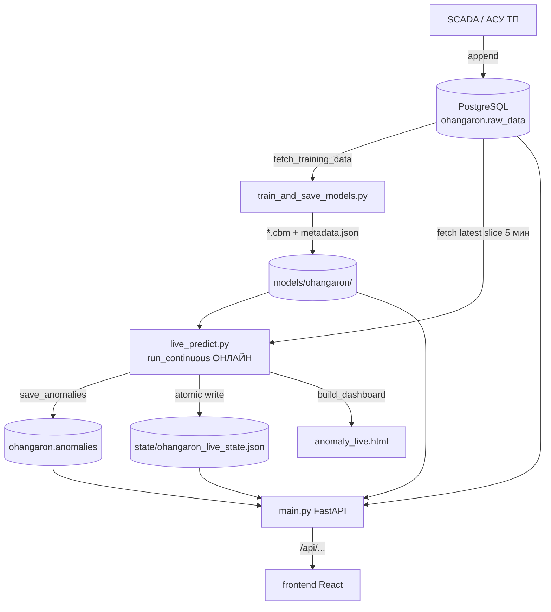

# 01. Архитектура

> ⚠️ **Актуальная архитектура (host-launch, 2026-07-01) — в [../ARCHITECTURE.md](../ARCHITECTURE.md).** Запуск — `python run.py` (FastAPI :8000 + Vite :5173 + ML); статический дашборд удалён.

## 1.1 Назначение

CS Monitor AI выявляет аномалии в работе компрессорной станции по телеметрии SCADA. Для каждого датчика обучается регрессионная модель «ожидаемого значения» (по другим датчикам и собственной истории); отклонение факта от прогноза, а также набор статистических правил, формируют аномалии. Результаты пишутся в БД и показываются на дашборде.

Архитектура **мульти-станционная**: каждая станция описывается YAML-конфигом; код параметризуется через `StationConfig`. Станция по умолчанию — `ohangaron`.

## 1.2 Компоненты

| Компонент | Роль | Тип процесса |
|-----------|------|--------------|
| PostgreSQL | Хранилище телеметрии (`raw_data`) и аномалий (`anomalies`) | внешний |
| `train_and_save_models.py` | Обучение моделей (офлайн, по требованию) | разовый запуск |
| `live_predict.py` | **Онлайн-детекция**: цикл каждые 5 мин, запись аномалий и состояния | постоянный фоновый |
| `main.py` (FastAPI) | REST API для фронтенда | постоянный (uvicorn, 4 воркера) |
| `frontend/` (React/Vite) | Дашборд оператора | статика/SPA |
| `models/<station>/` | Артефакты: `*.cbm` + `metadata.json` | файлы на диске |
| `state/<station>_live_state.json` | Снимок результатов последнего цикла для API | файл на диске |

## 1.3 Потоки данных



**Пояснения к потоку:**

1. **Ingestion.** Телеметрия попадает в `raw_data` извне (SCADA/АСУ ТП). `sync_raw_data.py` синхронизирует хвост БД в CSV (для бэкапа/анализа). Формат `raw_data` — long: `(datetime, point, value, health)`.
2. **Обучение (офлайн).** `train_and_save_models.py` читает всю историю (или до `--cutoff-date`), строит wide-таблицу (теги→столбцы), отбрасывает простои ГПА, обучает по одной CatBoost-модели на датчик и сохраняет `*.cbm` + единый `metadata.json` (метрики, маппинг тегов, гиперпараметры). Запускается вручную/по расписанию; в рантайме не вызывается.
3. **Детекция (онлайн).** `live_predict.py --mode live` каждые 5 минут забирает свежий срез `raw_data`, считает прогноз и 7 детекторов **по новым точкам** (`is_live`: время > `last_train_timestamp`), пишет аномалии в `anomalies`, состояние в `state.json`, HTML-дашборд. Подавляет ложные срабатывания на остановленных ГПА и в переходных режимах.
4. **API.** `main.py` читает `state.json` (с кешем по mtime), `metadata.json` и БД, отдаёт REST. Для графиков делает даунсемплинг прямо в БД (≤1500 точек). См. [04_api_reference.md](04_api_reference.md).
5. **UI.** React-дашборд опрашивает API каждые 30 с (TanStack Query), рисует графики (Plotly), тепловую карту, журнал событий, KPI.

## 1.4 Граница «обучение / мониторинг» (онлайн-семантика)

Ключевой инвариант: аномалии ищутся **только после** `last_train_timestamp`. На обучающем периоде прогноз — in-sample (тривиально точный), поэтому он не используется для алертов. Это делает детекцию по-настоящему «онлайн»: при работе системы каждую новую 5-минутку данные проверяются на лету. Бэкафилл по истории — отдельная разовая операция, не подменяющая онлайн-цикл.

## 1.5 Состояние и согласованность

- **`anomalies` (БД)** — устойчивый журнал аномалий (переживает рестарты), дедуп по `(sensor_id, event_ts, anomaly_type)`.
- **`state.json` (файл)** — оперативный снимок: текущие значения, серии за 30 дней (`v/p/lo/hi`), события, health-score по ГПА, model_drift. Перезаписывается атомарно (`*.tmp` → `os.replace`) каждый цикл.
- API объединяет оба источника: метаданные/серии из `state.json`, исторические аномалии — из БД.

## 1.6 Надёжность

- **Пул соединений** PostgreSQL (`ThreadedConnectionPool`, 2–10) на станцию, TCP keepalive, fail-fast по таймауту.
- **single-instance lock** (`logs/<name>.lock`) — второй экземпляр `live_predict` не стартует.
- **Graceful shutdown** по SIGINT/SIGTERM.
- **Backoff** в цикле: исключение одного цикла не убивает процесс; при `MemoryError` — сброс накопленных данных и перезагрузка истории.
- **Кеши:** mtime-кеш `state.json`/`metadata.json`; HTTP `Cache-Control` (25 с для живых, 3600 с для исторических окон); кеш `SELECT 1` для health (30 с).
- **Авторестарт** процессов через `.bat`-обёртки (`scripts/`).

## 1.7 Топология запуска (сейчас)

```
[ Windows-сервер + venv ]
   ├─ scripts/start_backend.bat      → uvicorn main:app :8000 (4 воркера), рестарт 10с
   └─ scripts/start_live_predict.bat → python live_predict.py --mode live, рестарт 30с
[ PostgreSQL ]  (CS_DB_HOST:CS_DB_PORT/CS_DB_NAME, схема ohangaron)
[ frontend ]    Vite dev (npm run dev) или сборка (npm run build) за статикой
```

Планируется единый запуск `run_system.py` (миграции → проверка моделей → API + онлайн-цикл вместе) — см. план, фаза 12.

## 1.8 Технологии

Python 3.11, FastAPI, uvicorn, pandas, numpy, CatBoost (`RMSEWithUncertainty`), scikit-learn, psycopg2, PyYAML, python-dotenv, joblib, plotly. Frontend: React 19, Vite 8, TypeScript, Plotly, TanStack Query, Tailwind. Деплой: Dockerfile (только API) + `.bat`-скрипты.
